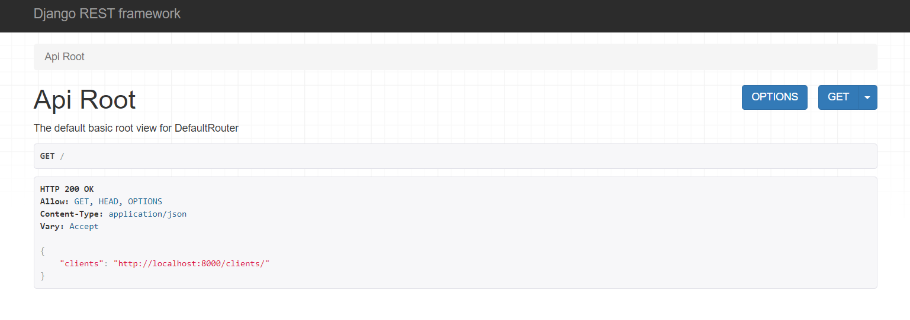

# django-api-clients
Repository created for the "API com Django 3: Validações, buscas, filtros e deploy" course in Alura.

# How to use

Clone the repository
```bash
git clone https://github.com/bonetou/django-api-clients
```
Install requirements
```bash
python -m pip install -r requirements.txt
```
Migrate
```bash
python manage.py migrate
```
Generate clients
```bash
python populate_script.py
```

Run the server
```bash
python manage.py runserver
```
Access localhost:8000 on your browser:

